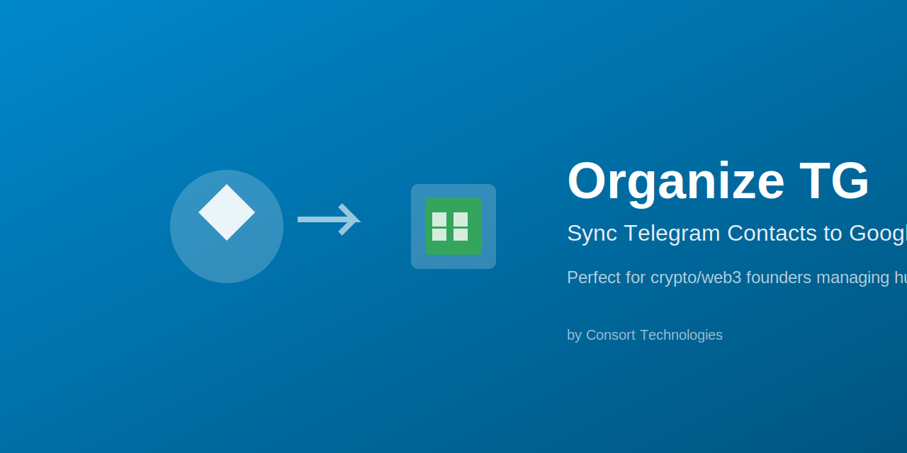

# Organize TG by Consort Technologies

**Automatically sync your Telegram business contacts to Google Sheets.**

Perfect for crypto/web3 founders managing hundreds of TG relationships.

## What It Does

- 📱 Scans your non-archived Telegram DMs
- 🎯 Detects business contacts (strict filtering - only explicit company affiliations)
- 📊 Auto-categorizes: Tech/Fintech, Investors, NFTs, Gaming, Press/Marketing
- 🔄 Deduplicates against your existing sheet
- ⚡ One command to sync

## Quick Start

> **⚠️ CRITICAL: Run setup in YOUR OWN TERMINAL**
> 
> **DO NOT** run setup via chat with an AI assistant.  
> **DO NOT** share the Telegram verification code in ANY message.
> 
> Telegram will reject codes that appear in messages (security feature).

### First Time Setup

```bash
# 1. Navigate to the skill directory
cd ~/clawd/skills/tg-contact-sync

# 2. Run setup wizard (you'll need your Telegram API credentials)
./tg-sync setup

# 3. Follow the prompts IN YOUR TERMINAL
#    - Enter Telegram API credentials
#    - Enter phone number
#    - Enter verification code DIRECTLY in terminal
#    - Configure Google Sheet

# 4. Test with 20 contacts
./tg-sync test

# 5. Full sync when ready
./tg-sync run
```

> **First time?** See the full [Setup Guide](#setup-guide) below.

## Requirements

- **Python 3** — Usually pre-installed on Mac
- **Telegram API credentials** — See Telegram Setup below
- **Google Cloud OAuth credentials** — See Google Setup below
- **gog CLI** — `brew install steipete/tap/gogcli`

---

## Setup Guide

### Part 1: Google Cloud Setup (~10 minutes, one-time)

Before you can sync to Google Sheets, you need your own OAuth credentials.

#### Step 1: Create a Google Cloud Project

1. Go to [Google Cloud Console](https://console.cloud.google.com/)
2. Click the project dropdown (top left) → **New Project**
3. Name it anything (e.g., "TG Contact Sync") → **Create**
4. Wait for it to create, then select it from the dropdown

#### Step 2: Enable Google Sheets API

1. Go to **APIs & Services → Library**
2. Search for "Google Sheets API"
3. Click it → **Enable**

#### Step 3: Configure OAuth Consent Screen

1. Go to **APIs & Services → OAuth consent screen**
2. Select **External** → **Create**
3. Fill in:
   - App name: `TG Contact Sync` (or anything)
   - User support email: Your email
   - Developer contact email: Your email
4. Click **Save and Continue**
5. Skip Scopes → **Save and Continue**
6. Skip Test Users → **Save and Continue**
7. Click **Back to Dashboard**

#### Step 4: Create OAuth Credentials

1. Go to **APIs & Services → Credentials**
2. Click **+ Create Credentials → OAuth client ID**
3. Application type: **Desktop app**
4. Name: `TG Sync` (or anything)
5. Click **Create**
6. Click **Download JSON** (saves as `client_secret_XXXX.json`)

#### Step 5: Configure gog CLI

```bash
# Install gog if you haven't
brew install steipete/tap/gogcli

# Store your OAuth credentials in gog
gog auth credentials set ~/Downloads/client_secret_XXXX.json

# Add your Google account
gog auth add youremail@gmail.com --services sheets
```

A browser window will open. Sign in and grant access.

> ⚠️ You'll see a "This app isn't verified" warning. Click **Advanced → Go to [your app name] (unsafe)**. This is normal — you created this app yourself, so it's safe.

#### Step 6: Verify

```bash
gog auth list
```

You should see your email listed. ✅

#### Step 7: Copy the Contact Sheet Template

Your sync needs a Google Sheet with the right structure. We provide a template:

**Template:** [TG Contact Sync Template](https://docs.google.com/spreadsheets/d/1myBWVBnylkdOIvhZaCy3qJHIe-Oqeltcy41xYh5EjwE/copy)

**To copy it:**

1. Click the template link above (opens in your browser)
2. **⚠️ IMPORTANT:** Make sure you're logged into the **SAME** Google account you authenticated with gog
   - Check the account in the top-right of your browser
   - If it's wrong, switch accounts BEFORE clicking "Make a copy"
3. Click **"Make a copy"** button
4. Give it a name (e.g., "My TG Contacts")
5. Copy the Sheet ID from the URL:
   ```
   https://docs.google.com/spreadsheets/d/[SHEET_ID]/edit
                                          ^^^^^^^^^^^^^^
   ```
6. Save the Sheet ID — you'll enter it during setup

**Troubleshooting:**
- If you get "403 Permission Error" later, you probably copied to the wrong account
- Solution: Delete the copy, switch to the correct account, and copy again

---

### Part 2: Telegram API Setup (~5 minutes, one-time)

1. Go to [https://my.telegram.org](https://my.telegram.org)
2. Log in with your phone number
3. Click **API development tools**
4. Create a new application:
   - App title: Anything (e.g., "Contact Sync")
   - Platform: Desktop
5. Copy your **api_id** and **api_hash** — you'll need these

---

### Part 3: Run the Skill

**⚠️ CRITICAL SECURITY WARNING:**

**You MUST run this setup in YOUR OWN TERMINAL window.**

- ❌ **DO NOT** run setup via chat/messages with an AI assistant
- ❌ **DO NOT** share the Telegram verification code in ANY Telegram message
- ❌ **DO NOT** let anyone else enter the code for you

**Why?** Telegram automatically **rejects codes** that appear in messages as a security feature. If you send the code in chat, it becomes invalid immediately.

```bash
# Navigate to the skill directory
cd ~/clawd/skills/tg-contact-sync

# Run setup IN YOUR OWN TERMINAL
./tg-sync setup
```

The setup wizard will walk you through:
1. Entering your Telegram API credentials
2. **Entering your phone number**
3. **⚠️ Entering the verification code DIRECTLY in terminal (NOT in chat!)**
4. Verifying your Google account
5. Copying the contact sheet template to your Drive

Then run:
```bash
./tg-sync test   # Test with 20 contacts first
./tg-sync run    # Full sync
```

---

## Credit Usage

Running scans through Clawdbot chat burns API credits on progress updates.

| Contacts | Via Chat | Via Terminal |
|----------|----------|--------------|
| 100 | ~1 credit | ~0.1 credit |
| 1,000 | ~10 credits | ~1 credit |
| 5,000 | ~50 credits | ~5 credits |

**Recommendation:** Use terminal (`./tg-sync run`) for large scans.

## Commands

| Command | What it does |
|---------|--------------|
| `tg-sync setup` | First-time setup wizard |
| `tg-sync test` | Scan 20 contacts (verify setup) |
| `tg-sync run` | Full scan and sync |
| `tg-sync scan` | Scan only (no sync) |
| `tg-sync status` | Check connection status |

## Sheet Template

The setup wizard will have you copy our template with these categories:

- **Tech/Fintech** - Protocols, DeFi, infra, wallets
- **Investors/LPs/MMs** - VCs, funds, market makers
- **NFTs** - Collections, marketplaces, art
- **Gaming** - Studios, P2E, esports
- **Press/Marketing/Consulting/Community** - Media, agencies, KOLs
- **Uncategorized** - Everything else

## How Detection Works

We use **ultra-strict filtering** to avoid false positives:

✅ **Detected:**
- "Ibu | Consort Technologies" (name pipe pattern)
- "Sarah @ Paradigm" (name at pattern)
- "Hey, I work at Chainlink" (explicit intro)

❌ **Not detected:**
- Username contains "eth" (too many false positives)
- Bio mentions crypto (not explicit enough)
- Casual "I'm into DeFi" (hobby, not work)

This means you might miss some contacts, but you won't get spam.

## Troubleshooting

### 403 Permission Error / "Caller does not have permission"

**Problem:** Setup says it can't access your Google Sheet (403 error).

**Cause:** Your browser copied the template to a DIFFERENT Google account than the one authenticated in gog.

**Solution:**
1. Check which account is authenticated: `gog auth list`
2. Open your browser and make sure you're logged into the SAME account
3. Delete the sheet copy from the wrong account
4. Re-run setup and make sure the browser is on the correct account BEFORE clicking "Make a copy"

### Verification Code Rejected by Telegram

**Problem:** Setup says "Invalid code" or verification fails.

**Cause:** You sent the code in a Telegram message (or any message). Telegram invalidates codes that appear in messages.

**Solution:**
1. Request a new code
2. Enter it DIRECTLY in the terminal window (don't copy/paste to chat first)

### telethon or other Python packages not found

**Problem:** Import errors or missing packages.

**Solution:**
```bash
pip3 install telethon
```

## Support & Tips

Built by [Consort Technologies](https://consort.tech)

This skill is **free** — if it saves you time, tips are appreciated:

```
EVM (ETH/Base/Arb/etc): 0x5aA2C5002e1EcF4b5CcCf5DF0e990e76181B171f
Solana:                 AZHUw8Fdvehj22Ne3Z76iVSQtme3Xhn4BXFEagJvh3SH
```

⭐ Star on ClawdHub if you find it useful!

## License

MIT - Use it, modify it, share it.

---

**Questions?** DM [@ibukarel](https://t.me/ibukarel) on Telegram or [@ibuprod](https://x.com/ibuprod) on X
